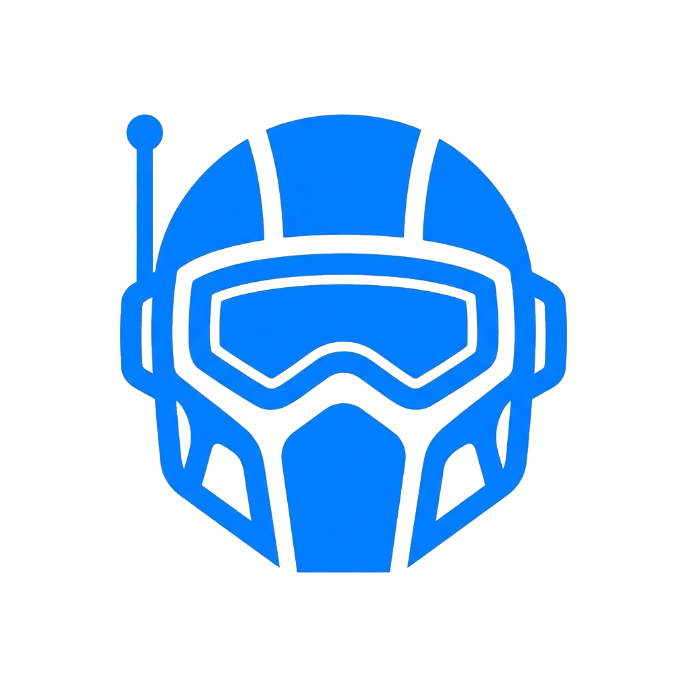
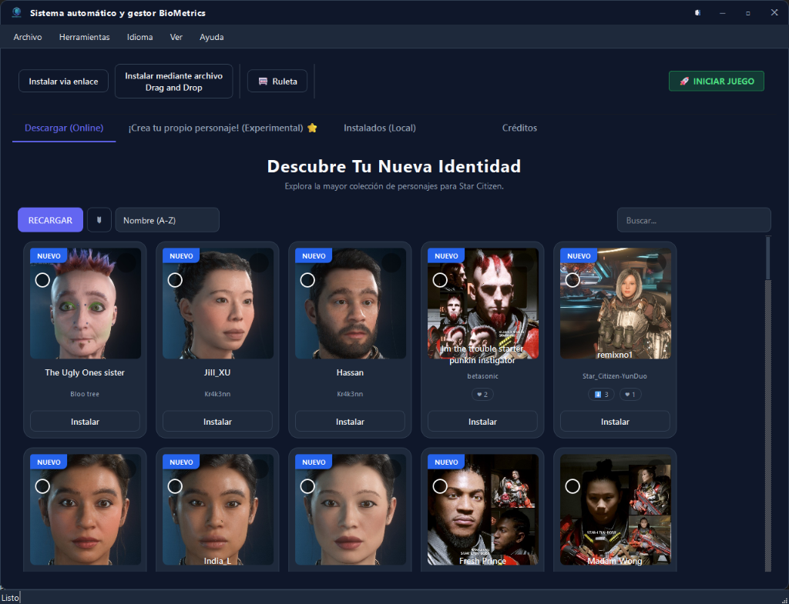
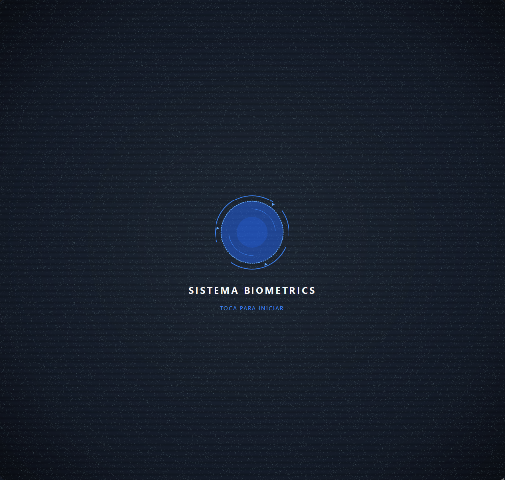

  
  <h1>🧬 BioMetrics - Star Citizen Character Manager</h1>
  <h3><i>The Ultimate Character Customization & DNA Preset Tool for Star Citizen</i></h3>
   
  
     

**SCCharacters (BioMetrics)** is a powerful, immersive desktop application designed to streamline the management, installation, and customization of your **Star Citizen character appearances** (`.chf` files). Whether you're looking to **import character presets**, backup your **Star Citizen DNA**, or share your avatar with the community, this tool serves as your personal extensive biometric database. It simplifies the process of changing your in-game appearance without manually editing files.

---

## 🖼️ Interface Gallery

  
    
  

---

## 🚀 Features at a Glance

| 🦾 **Core Systems** | 🌐 **Connectivity** | 🎨 **Experience** |
| :--- | :--- | :--- |
| **Seamless Installs** One-click import from web or local files. | **Online Repo** Access hundreds of community characters. | **Sci-Fi UI** Immersive "diegetic" design aesthetics. |
| **Backup & Restore** Never lose your favorite faces again. | **Multi-Language** Localized in 10 major languages. | **Audio Feedback** Premium sound effects integration. |
| **BioMetrics Editor** Edit metadata and organize your fleet. | **Multi-Environment** Deploy to LIVE, PTU, and EPTU. | **Smart Detect** Auto-configuration of game paths. |

---

## 📥 Installation

### Prerequisites
- Windows 10/11
- Star Citizen installed (LIVE/PTU)

## 🎮 Game Compatibility & Support

**BioMetrics** is updated regularly to support the latest Star Citizen patches.

✅ **Fully Compatible with the Latest Star Citizen Version**

*Compatible with LIVE, PTU, EPTU and EVO environments.*

### Installation

  

1. **Download**: Click the button above to download `SCCharacters.exe` directly.
2. **Run**: Double-click the executable to launch the tool.
   - *Note: You may need to bypass Windows SmartScreen as this is a new unsigned application.*
   - *No installation required - it's a portable app.*

---

## 🖥️ Usage

1. **Launch BioMetrics**: Open the application. On first run, it will attempt to auto-detect your Star Citizen `CustomCharacters` folder.
2. **Import Characters**:
   - Go to the **Online Tab** to browse and download.
   - Or drop your `.chf` files into the **Installed Tab**.
3. **Apply to Game**: Once installed, the characters appear in your Star Citizen character customization menu under "Import Character".

---

## ❓ Frequently Asked Questions (FAQ)

### How do I install Star Citizen character presets?
Simply download the **BioMetrics Manager**, browse the online repository tab, and click "Install" on any character you like. The tool handles the file placement automatically.

### Where are Star Citizen character files located?
Star Citizen stores character files in `StarCitizen\LIVE\user\client\0\CustomCharacters`. BioMetrics detects this path automatically so you don't have to find it yourself.

### Can I share my Star Citizen character DNA?
Yes! Use the **Backup** feature to export your character to a file, which you can then share with friends or the community.

### Is this tool safe to use with Star Citizen?
Yes, this tool only manages local `.chf` files (character presets) and does not modify game memory or executable files. It is compliant with the Star Citizen Fandom FAQ.

---

## 💬 Community

Join our growing community on Discord to share your characters, ask for help, or discuss features:

---

## 🤝 Contributing

Contributions are welcome! If you have ideas for new features or language improvements:
1. Fork the repository.
2. Create your feature branch (`git checkout -b feature/AmazingFeature`).
3. Commit your changes (`git commit -m 'Add some AmazingFeature'`).
4. Push to the branch (`git push origin feature/AmazingFeature`).
5. Open a Pull Request.

---

## 🌟 Acknowledgements

Special thanks to these incredible resources that made this project possible:
- **[Star Citizen Characters](https://www.star-citizen-characters.com/)**: The primary source for collecting diverse character profiles.
- **[StarChar.app](https://starchar.app/)**: An essential tool used for detailed character customization and creation.

---

## 📜 Credits

**Creator**: [SpielerWAN]([https://www.youtube.com/@SpielerWAN](https://www.twitch.tv/spielerwan))
*Star Citizen Content Creator*

---

---

## ⚖️ Legal Disclaimer | [Roberts Space Industries](https://robertsspaceindustries.com/)

  
    

This project is an **unofficial fan-made tool** and is not affiliated with, endorsed by, or sponsored by Cloud Imperium Games (CIG) or Roberts Space Industries (RSI).

All content related to Star Citizen is property of Cloud Imperium Rights LLC.
**Star Citizen®**, **Roberts Space Industries®**, and **Cloud Imperium®** are registered trademarks of Cloud Imperium Rights LLC.

This project adheres to the [Star Citizen Fandom FAQ](https://support.robertsspaceindustries.com/hc/en-us/articles/360006895793-Star-Citizen-Fankit-and-Fandom-FAQ).

> *This is an unofficial Star Citizen fan project, not affiliated with the Cloud Imperium group of companies. All content on this site not authored by its host or users are property of their respective owners.*
